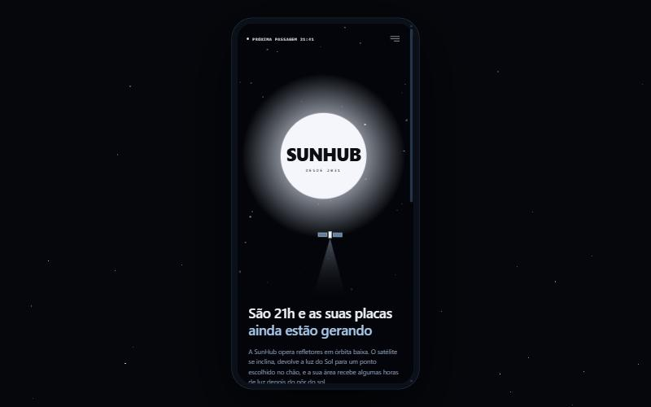
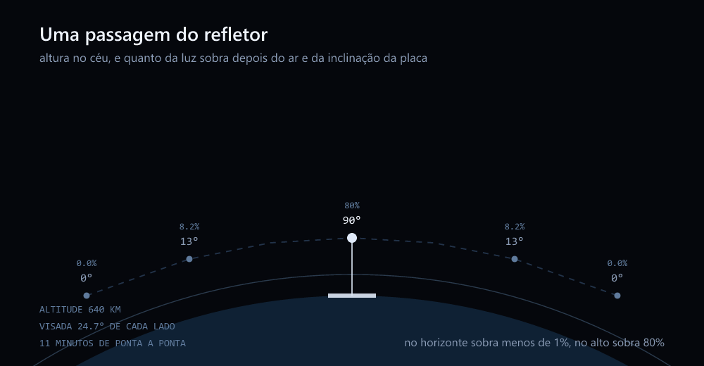
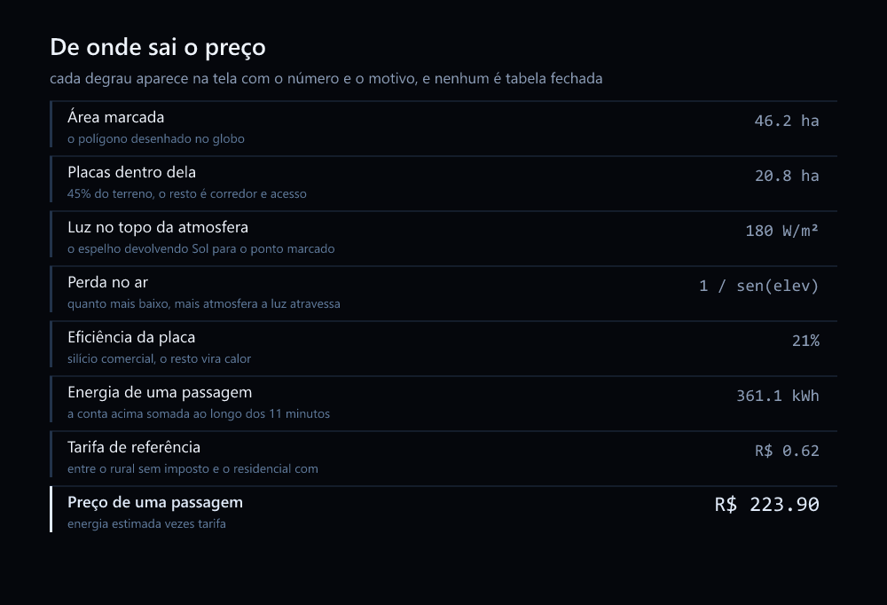

# SunHub

Comprar luz do Sol depois que ele se põe. Um simulador de refletores em órbita baixa, do globo até o orçamento.

[](https://github.com/Pedroaruana/SunHub/actions/workflows/verificar.yml)


[](https://sunhub.aruanapedro.workers.dev)

**[sunhub.aruanapedro.workers.dev](https://sunhub.aruanapedro.workers.dev)**



Refletor orbital devolvendo luz do Sol para um ponto do chão é linha de pesquisa real, e é sobre ela que a simulação foi feita. **Não existe empresa SunHub.** Nenhuma energia é vendida, nenhum valor é cobrado, e o fechamento gera um orçamento simulado que diz isso na própria tela.

## Funcionalidades

- **Marcar a área** girando um globo com imagem de satélite de verdade, sem digitar endereço em barra de busca. A mira fica parada no centro e quem anda é o planeta, debaixo dela. Dá pra chegar na propriedade só com o dedo, sem dar permissão de localização
- **Ver o Sol e a sombra em 24 horas** naquele ponto exato, com a trajetória calculada e a sombra projetada hora a hora. O terreno escurece e clareia conforme a altura do Sol
- **Assistir à passagem do refletor**, que nasce num horizonte, cruza o céu a 640 km, se inclina para apontar o espelho e devolve luz durante 11 minutos. A potência e a energia sobem na tela enquanto ele passa
- **Escolher o pacote** com a cadeia de cálculo aberta, degrau por degrau, do polígono desenhado até o preço. Nenhum número aparece sem o motivo do lado
- **Fechar um orçamento simulado**, com protocolo, guardado no próprio aparelho. Sem conta, sem campo de pagamento, sem pedir nome, CPF ou endereço

Tudo em português e inglês. Roda como site e como aplicativo Android, do mesmo código.

## Como funciona

Toda a conta sai de cinco arquivos em `src/domain` que não sabem que existe tela. O que a interface faz é perguntar e desenhar.

### A geometria da passagem



O arco é raso porque ele é raso: 640 km de altitude contra 6.371 km de raio da Terra dá pouco mais de um décimo, e a visada inteira são 24,7 graus de cada lado.

O que importa aqui são as duas perdas, e elas se multiplicam. Uma é quanto da luz sobrevive ao ar: quanto mais baixo o refletor, mais atmosfera a luz atravessa, e isso cai exponencial. A outra é quanto a placa deitada consegue captar do que chegou, que é o seno da elevação. No zênite sobram 80%. A 13 graus sobram 8%. No horizonte não sobra nada.

É por isso que não existe vender "uma hora de luz": o que existe é múltiplo de passagem, e o começo e o fim de cada uma rendem quase zero.

### De onde sai o preço



A tarifa de R$ 0,62 não é média de nada, porque média rural nacional publicada não existe. É um meio termo entre os R$ 0,462 do rural B2 homologado, que é sem imposto, e a faixa de R$ 0,73 a R$ 0,95 do residencial já com imposto. O número e o porquê estão no código e na tela.

Os dois desenhos acima saem de [`scripts/diagramas.mjs`](scripts/diagramas.mjs), e os números vêm das mesmas funções que a tela usa. Se o modelo mudar, roda o script de novo e o diagrama acompanha, em vez de virar figura velha mentindo no README.

## Stack

| | |
|---|---|
| Interface | React 19, React Router 8, Tailwind CSS 4, Zustand |
| Globo | CesiumJS 1.145 com imagem da Esri, sem token do Cesium Ion |
| Build | Vite 8, TypeScript 6 |
| Aplicativo | Capacitor 8, Android |
| Testes | Vitest no núcleo, Playwright nas telas, contra o build |
| Qualidade | Biome, GitHub Actions, CodeQL |
| Hospedagem | Cloudflare, Worker com arquivos estáticos |

## Arquitetura

```
src/
  domain/      o núcleo, sem nenhuma referência a tela
    orbita.ts      altitude, visada, elevação e distância na passagem
    incidencia.ts  perda no ar e inclinação da placa, separadas
    energia.ts     potência e energia, com integração de passo fixo
    preco.ts       tarifa e orçamento
    validacao.ts   área em hectares e os seis códigos de erro
  scene/       só Cesium: criar o globo e achar o Sol
  hooks/       o ciclo de vida do viewer, o fluxo, o SEO, os textos
  components/  moldura, topo, menu, painel e a barreira de erro
  pages/       as dez telas
  i18n/        os dois dicionários, o português mandando no tipo
  lib/         geolocalização, arquivos, formato, armazenamento
e2e/           os testes de tela
scripts/       assets do Cesium, ícones, imagem social, prerender, diagramas
```

A regra que segurou tudo: **`src/domain` não sabe que existe tela.** Não importa React, não toca no DOM, não lê nada do navegador. É por isso que dá pra testar o modelo inteiro sem abrir navegador, e é por isso que o mesmo número aparece igual na tela da passagem e na do pacote.

O português é a fonte da verdade dos textos. O tipo do dicionário sai dele e o inglês tem que encaixar: esquecer uma chave quebra o compilador antes de rodar.

As três telas de mapa entram por carregamento sob demanda. O Cesium sozinho são 4,1 MB, e quem só abre a inicial baixa 325 kB.

O build também gera um HTML por rota, com título, descrição e canonical próprios, porque robô de busca em geral não roda JavaScript e encontraria uma página em branco.

## Rodando

```bash
npm install
npm run dev
```

O `postinstall` copia os assets do Cesium de `node_modules` para `public/cesium`. Sem isso o globo não carrega em desenvolvimento.

```bash
npm run build     # ícones, imagem social, tipos, Vite e prerender
npm run preview   # serve o build
```

## Testes

```bash
npm test          # 83 testes no núcleo, sem navegador
npm run test:tela # 19 testes abrindo o site e clicando
```

Os testes do núcleo conferem contra valor que dá pra checar na mão: um quadrado de 1 km de lado tem que dar 100 hectares, no zênite a distância do refletor tem que ser exatamente a altitude, e a energia acumulada até o fim da passagem tem que fechar com a passagem inteira.

Os de tela rodam contra o build, não contra o servidor de desenvolvimento, porque é o build que o usuário recebe. Eles percorrem o fluxo inteiro e também os caminhos de erro: rota que não existe, coordenada adulterada no armazenamento e área com três cantos.

Da primeira vez o Playwright precisa do navegador: `npx playwright install chromium`.

## Android

```bash
npm run apk
```

Precisa do SDK do Android e da variável `ANDROID_HOME`. O APK sai em `android/app/build/outputs/apk/debug/`.

Capacitor e não React Native porque o núcleo da coisa é WebGL: com React Native eu teria que reescrever as três telas de mapa numa ponte nativa, e o Cesium não roda lá.

## Docker

```bash
docker build -t sunhub .
docker run -p 8080:80 sunhub
```

A configuração do nginx é gerada a partir do `public/_headers` por [`scripts/nginx.mjs`](scripts/nginx.mjs), para a política de segurança não existir escrita em dois lugares.

## Dificuldades

**O zoom que ia pro lugar errado.** Eu clicava em "descer aqui" e a câmera dava um salto de 25 km. Levei um tempo olhando a lógica de voo até perceber que o erro era uma subtração: eu tirava `0.004` da latitude achando que era grau, e ela está em radiano. 0,004 radiano são 25 km. Hoje o recuo sai de metros divididos pelo raio da Terra, e abaixo de 4.000 m de altura ele nem voa.

**A energia que mudava de máquina para máquina.** Eu acumulava a energia quadro a quadro dentro da animação da passagem. Numa rodada saiu 22 kWh onde a conta fechada dava quase 85, e em outra máquina dava outro número. Conta de energia não pode depender de taxa de quadros. A integração subiu para o núcleo com passo fixo, e a tela só pergunta quanto já rendeu até ali.

**O caminho do Sol que saía vazio.** Nenhum ponto aparecia na tela, e a conta estava certa. O `computeIcrfToFixedMatrix` do Cesium devolve `undefined` enquanto os dados de orientação da Terra não terminam de carregar, e o meu plano B era matriz identidade. Com identidade o vetor do Sol fica no referencial inercial, o teste de horizonte nunca passa e não sobra ponto nenhum. O plano B certo é `computeTemeToPseudoFixedMatrix`.

**A iluminação que não iluminava.** O `enableLighting` do Cesium não fazia diferença nenhuma e eu ia culpar a minha configuração. Antes de contornar, medi: peguei o brilho dos pixels do chão com ele ligado e desligado, e deu 137 nos dois. Então dia e noite passaram a sair do brilho da camada de imagem, controlado pela altura do Sol que o núcleo já calcula.

**A política de segurança que derrubou o globo.** Escrevi os cabeçalhos e só fui rodar o site com eles aplicados dias depois. As três telas de mapa abriram em preto. Eram dois problemas: o `CESIUM_BASE_URL` estava num script inline, que a política bloqueia, e o Viewer do Cesium carrega o Knockout junto, cujo preâmbulo faz `(0,eval)("this")`. Fui ver o que evaluava antes de liberar. Virou arquivo externo e um `unsafe-eval` com o motivo escrito ao lado.

**A barra no fim do endereço que apagou o site do índice.** Essa só apareceu em produção. A hospedagem redireciona `/sol` para `/sol/`, e a minha busca de rota só conhecia a versão sem barra. O HTML gerado chegava certo, e assim que o React montava ele reescrevia o título para "Página não encontrada" e marcava `noindex`. Em todas as rotas menos a raiz. Os testes não pegaram porque liam o HTML cru, e o servidor de desenvolvimento não redireciona. Hoje existe um teste que olha a página já montada, com a barra no fim.

**A moldura que zerou a tela no celular.** Pus o aparelho desenhado em volta da tela no desktop, conferi lá e achei que estava pronto. A camada a mais de elemento fazia a tela encolher para zero no celular, porque as telas de mapa posicionam tudo de forma absoluta e não empurram altura. O canvas do globo nascia com `height="0"`. Quem acusou foi o Playwright, não eu.

**A fazenda que eu não achava.** Eu queria que o zoom terminasse numa usina solar de verdade, visível na imagem de satélite. Pirapora e Nova Olinda não aparecem nessa camada. Varri tiles por script até achar Bhadla, no Rajastão, e confirmei no olho em vez de confiar no detector de cor, que antes tinha apontado o rio São Francisco como painel solar.

## Licença

MIT. Ver [LICENSE](LICENSE).
